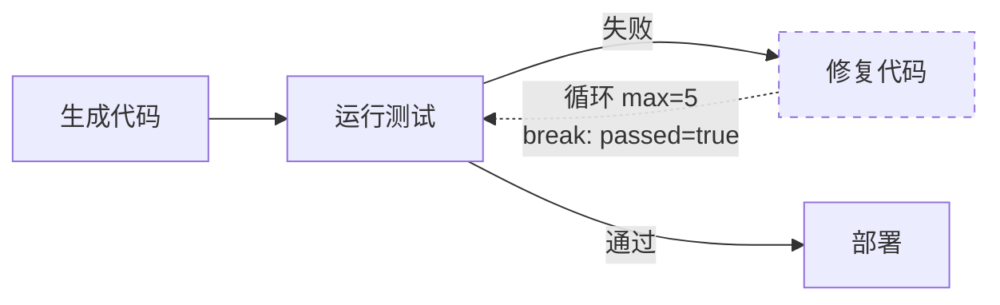

# Agent Teams 循环边设计方案

- 作者：elecvoid243
- 日期：2026-09-07
- 前作：
  - [2026-09-07-agent-teams-conditional-branching-design.md](./2026-09-07-agent-teams-conditional-branching-design.md)（Phase 1）
  - [2026-09-07-agent-teams-human-input-design.md](./2026-09-07-agent-teams-human-input-design.md)（Phase 2）
- 状态：设计评审
- 适用基线：Agent Teams 主体功能 + Refinements + Phase 1（条件分支）+ Phase 2（Human Input）已落地

## 1. 背景与目标

Agent Teams 当前 DAG 是**严格无环图**，节点按拓扑顺序执行一次。实际场景常需**迭代优化**：

- 代码生成 → 测试 → **未通过则返回修复** → 再测试（循环直到通过）
- 数据处理 → 质量检查 → **不合格则返回清洗** → 再检查
- 方案生成 → 评估 → **评分低则返回改进** → 再评估
- 内容创作 → 审校 → **有问题则返回修改** → 再审校

本设计引入**循环边**（后继连回前驱），配合条件表达式和迭代上限，实现受控的迭代执行。

### 1.1 核心设计决策

| 决策点 | 结论 |
|---|---|
| 环检测放宽 | 编辑器允许后继连回前驱（形成环），但需标记为循环边 |
| 终止条件 | 必须配置：条件表达式 + 最大迭代次数（双重保险） |
| 迭代计数 | 每条循环边独立计数（多环路场景下互不干扰） |
| 条件求值 | 复用 Phase 1 的条件引擎，每次迭代开始前求值 |
| 超限行为 | 达到 `max_iterations` → 边视为不满足（后继节点不再执行，类似条件分支的 false） |
| 节点状态 | 节点可被重复执行（每次 status `pending → running → done`），状态中记录执行次数 |
| 失败处理 | 循环体内节点失败 → 走团队 `failure_policy`（pause/auto_skip），不特殊处理 |
| 死锁检测 | 运行时检测所有节点都在等待（循环依赖）→ run `failed` |

## 2. 数据模型

### 2.1 边扩展

```typescript
// Phase 1 后的边
interface WorkflowEdge {
  from: string;
  to: string;
  condition?: string;  // 条件表达式
  label?: string;
}

// Phase 3 扩展
interface WorkflowEdge {
  from: string;
  to: string;
  condition?: string;
  label?: string;
  
  // 新增：循环配置
  loop?: {
    max_iterations: number;  // 最大迭代次数（必填，范围 1-50）
    break_condition?: string;  // 提前退出条件（可选，满足则停止循环）
  };
}
```

**语义**：
- 无 `loop` 字段 = 普通边（不可形成环）
- 有 `loop` 字段 = 循环边（可连回前驱或祖先节点）

**示例**：
```json
{
  "edges": [
    {"from": "gen_code", "to": "test"},
    {
      "from": "test",
      "to": "fix",
      "condition": "{{test.output.passed}} == false",
      "label": "测试失败"
    },
    {
      "from": "fix",
      "to": "test",
      "label": "重新测试",
      "loop": {
        "max_iterations": 5,
        "break_condition": "{{test.output.passed}} == true"
      }
    },
    {
      "from": "test",
      "to": "deploy",
      "condition": "{{test.output.passed}} == true",
      "label": "测试通过"
    }
  ]
}
```

上例逻辑：
- `test → fix → test` 形成循环
- 每次迭代前检查 `break_condition`（测试通过则退出循环）
- 最多迭代 5 次
- 第 5 次后，`fix → test` 边视为不满足，循环终止
- 如果 `test.output.passed == true`，走 `test → deploy` 边

### 2.2 节点状态扩展

```python
# node_states 扩展
node_states = {
  "test": {
    "status": "done",
    "member_id": "tester",
    "task_rendered": "运行单元测试",
    "result": "3 个测试失败",
    "structured_output": {"passed": False, "failures": 3},
    "error": None,
    "started_at": 1234567890.0,
    "finished_at": 1234567891.0,
    "execution_count": 3,  # 新增：该节点被执行的次数
    "executions": [  # 新增：每次执行的历史（可选，用于调试/审计）
      {
        "iteration": 1,
        "started_at": 1234567890.0,
        "finished_at": 1234567891.0,
        "result": "5 个测试失败",
        "structured_output": {"passed": False, "failures": 5}
      },
      {
        "iteration": 2,
        "started_at": 1234567900.0,
        "finished_at": 1234567901.0,
        "result": "3 个测试失败",
        "structured_output": {"passed": False, "failures": 3}
      },
      {
        "iteration": 3,
        "started_at": 1234567910.0,
        "finished_at": 1234567911.0,
        "result": "测试全部通过",
        "structured_output": {"passed": True, "failures": 0}
      }
    ]
  }
}
```

**说明**：
- `execution_count`：节点累计执行次数（循环中的节点 > 1）
- `executions`：历史记录数组（v1 保留最近 10 次，用于前端查看迭代过程）
- 最后一次执行的结果覆盖顶层 `result` / `structured_output`（供条件求值）

### 2.3 边迭代计数

```python
# DAGRunner 运行时状态（内存，不持久化）
self._edge_iterations = {
  "fix->test": 0,  # 边 ID -> 当前迭代次数
}
```

每次循环边执行前递增计数，达到 `max_iterations` 后该边不再触发。

## 3. 图校验改动

### 3.1 环检测放宽

**现有**：Kahn 拓扑排序，发现环 → 校验失败

**新规则**：
1. 分离循环边和普通边
2. 仅用普通边做拓扑排序（必须无环）
3. 循环边可指向祖先节点，但必须标记 `loop` 字段
4. 循环边的 `to` 节点必须是 `from` 节点的祖先（拓扑序中在前）

**校验逻辑**：
```python
def validate_workflow_with_loops(nodes: list[dict], edges: list[dict]) -> list[dict]:
    """校验支持循环的工作流（Phase 3）。"""
    errors = []
    
    # 1. 分离循环边和普通边
    loop_edges = [e for e in edges if "loop" in e and e["loop"]]
    normal_edges = [e for e in edges if "loop" not in e or not e["loop"]]
    
    # 2. 普通边必须无环（Kahn 排序）
    try:
        topo_order = kahn_topological_sort(nodes, normal_edges)
    except DAGCycleError as e:
        errors.append({
            "path": "edges",
            "code": "CYCLE",
            "message": f"Non-loop edges form a cycle: {e}"
        })
        return errors
    
    # 3. 校验循环边
    node_topo_index = {nid: idx for idx, nid in enumerate(topo_order)}
    
    for i, edge in enumerate(loop_edges):
        # 3.1 必须有 max_iterations
        if not edge.get("loop", {}).get("max_iterations"):
            errors.append({
                "path": f"edges[{edges.index(edge)}].loop.max_iterations",
                "code": "REQUIRED",
                "message": "Loop edge must have max_iterations"
            })
            continue
        
        max_iter = edge["loop"]["max_iterations"]
        if not isinstance(max_iter, int) or max_iter < 1 or max_iter > 50:
            errors.append({
                "path": f"edges[{edges.index(edge)}].loop.max_iterations",
                "code": "INVALID_RANGE",
                "message": "max_iterations must be between 1 and 50"
            })
        
        # 3.2 循环边必须连回祖先（后继指向前驱）
        from_node, to_node = edge["from"], edge["to"]
        if from_node not in node_topo_index or to_node not in node_topo_index:
            continue  # 节点不存在由其他校验覆盖
        
        if node_topo_index[to_node] >= node_topo_index[from_node]:
            errors.append({
                "path": f"edges[{edges.index(edge)}]",
                "code": "INVALID_LOOP",
                "message": f"Loop edge must point backward (from '{from_node}' to ancestor '{to_node}')"
            })
        
        # 3.3 校验 break_condition 语法（可选）
        break_cond = edge.get("loop", {}).get("break_condition")
        if break_cond:
            cond_error = validate_condition_syntax(break_cond, [n["id"] for n in nodes])
            if cond_error:
                errors.append({
                    "path": f"edges[{edges.index(edge)}].loop.break_condition",
                    "code": "INVALID_SYNTAX",
                    "message": cond_error
                })
    
    return errors
```

### 3.2 死锁预防

**静态检测**：无法完全预防（需运行时判断），但可检测明显死锁模式：
- 所有节点都在循环中 + 没有外部入口 → 警告
- 循环边的条件总是 true + 无 break_condition → 警告

**运行时检测**（§4.3）：所有节点都处于 `pending` 且无边可触发 → `failed`

## 4. 后端实现

### 4.1 DAGRunner 初始化

```python
class DAGRunner:
    def __init__(self, team, workflow, input_text, ports):
        # ... 现有初始化 ...
        
        # 新增：循环边计数器
        self._edge_iterations: dict[str, int] = {}
        
        # 新增：节点执行次数
        for node_id in self.node_states:
            self.node_states[node_id]["execution_count"] = 0
            self.node_states[node_id]["executions"] = []
    
    def _edge_key(self, edge: dict) -> str:
        """生成边的唯一键。"""
        return f"{edge['from']}->{edge['to']}"
```

### 4.2 边触发逻辑

```python
def _get_ready_nodes(self) -> list[str]:
    """获取就绪节点（Phase 3 扩展）。"""
    ready = []
    
    for node_id, state in self.node_states.items():
        if state["status"] != "pending":
            continue
        
        # 检查入边
        incoming_edges = [e for e in self.graph["edges"] if e["to"] == node_id]
        if not incoming_edges:
            ready.append(node_id)  # 入口节点
            continue
        
        # 至少一条入边满足
        if self._has_satisfied_incoming_edge(node_id, incoming_edges):
            ready.append(node_id)
    
    return ready

def _has_satisfied_incoming_edge(self, node_id: str, incoming_edges: list[dict]) -> bool:
    """检查是否有至少一条入边满足（Phase 1 + Phase 3 合并）。"""
    # 所有源节点必须完成
    source_nodes = [e["from"] for e in incoming_edges]
    if not all(self.node_states[src]["status"] in ("done", "skipped") for src in source_nodes):
        return False
    
    # 分离无条件边、条件边、循环边
    unconditional = [e for e in incoming_edges if not e.get("condition") and not e.get("loop")]
    conditional = [e for e in incoming_edges if e.get("condition") and not e.get("loop")]
    loop_edges = [e for e in incoming_edges if e.get("loop")]
    
    # 无条件边总是满足
    if unconditional:
        return True
    
    # 检查条件边（Phase 1 逻辑）
    context = self._build_condition_context()
    evaluator = ConditionEvaluator()
    
    for edge in conditional:
        result, error = evaluator.evaluate(edge["condition"], context)
        if error:
            raise DAGExecutionError(f"Condition syntax error: {error}")
        if result:
            return True
    
    # 检查循环边
    for edge in loop_edges:
        if self._check_loop_edge(edge, context, evaluator):
            return True
    
    return False

def _check_loop_edge(self, edge: dict, context: dict, evaluator: ConditionEvaluator) -> bool:
    """检查循环边是否满足（Phase 3 新增）。"""
    edge_key = self._edge_key(edge)
    current_iter = self._edge_iterations.get(edge_key, 0)
    max_iter = edge["loop"]["max_iterations"]
    
    # 超过最大迭代次数 → 边不满足
    if current_iter >= max_iter:
        return False
    
    # 检查常规条件（可选）
    if edge.get("condition"):
        result, error = evaluator.evaluate(edge["condition"], context)
        if error:
            raise DAGExecutionError(f"Loop edge condition error: {error}")
        if not result:
            return False
    
    # 检查提前退出条件（可选）
    break_cond = edge["loop"].get("break_condition")
    if break_cond:
        result, error = evaluator.evaluate(break_cond, context)
        if error:
            raise DAGExecutionError(f"Break condition error: {error}")
        if result:
            # 满足退出条件 → 边不满足（终止循环）
            return False
    
    # 循环边满足 → 递增计数
    self._edge_iterations[edge_key] = current_iter + 1
    return True
```

### 4.3 节点重复执行

```python
async def _execute_node(self, node_id: str, state: dict) -> None:
    """执行节点（Phase 3 扩展）。"""
    node = self._find_node(node_id)
    
    # 保存上次执行结果到历史（如果是重复执行）
    if state["execution_count"] > 0:
        state["executions"].append({
            "iteration": state["execution_count"],
            "started_at": state.get("started_at", 0),
            "finished_at": state.get("finished_at", 0),
            "result": state.get("result"),
            "structured_output": state.get("structured_output"),
            "error": state.get("error"),
        })
        # 限制历史长度
        if len(state["executions"]) > 10:
            state["executions"] = state["executions"][-10:]
    
    # 重置状态（准备新一次执行）
    state["status"] = "running"
    state["started_at"] = time.time()
    state["result"] = None
    state["structured_output"] = None
    state["output_error"] = None
    state["error"] = None
    state["finished_at"] = 0
    state["execution_count"] += 1
    
    # 执行节点（现有逻辑）
    if node.get("type") == "human_input":
        await self._execute_human_input_node(node_id, state, node)
    else:
        await self._execute_member_node(node_id, state, node)
    
    # 发射事件时附带迭代信息
    self._emit("node_status", {
        "node_id": node_id,
        "status": state["status"],
        "execution_count": state["execution_count"],
        "result": state.get("result"),
        "structured_output": state.get("structured_output"),
    })
```

### 4.4 死锁检测

```python
async def run(self):
    """运行 DAG（Phase 3 扩展）。"""
    while not self._is_complete():
        ready_nodes = self._get_ready_nodes()
        
        if not ready_nodes:
            # 无就绪节点但未完成 → 可能死锁
            pending_nodes = [nid for nid, s in self.node_states.items() if s["status"] == "pending"]
            if pending_nodes:
                # 死锁检测：所有 pending 节点的入边都不满足
                self._emit("error", {
                    "message": f"Deadlock detected: {len(pending_nodes)} nodes stuck",
                    "stuck_nodes": pending_nodes
                })
                self.status = "failed"
                await self._persist_run()
                return
            break  # 无 pending 节点 → 正常完成
        
        # 并行执行就绪节点
        await self._execute_wave(ready_nodes)
    
    # ... 完成逻辑 ...
```

### 4.5 完成判定

```python
def _is_complete(self) -> bool:
    """判断是否完成（考虑循环）。"""
    # 所有节点都是终态（done/skipped/failed）
    for state in self.node_states.values():
        if state["status"] not in ("done", "skipped", "failed", "interrupted"):
            return False
    return True
```

**关键**：循环体内的节点可能被执行多次，但最终会因为：
1. 循环边达到 `max_iterations` 不再触发
2. `break_condition` 满足提前退出
3. 条件边选择了其他路径（跳出循环）

其中之一而终止，进入终态。

## 5. 前端实现

### 5.1 编辑器 - 循环边创建

```vue
<template>
  <div v-if="selectedEdge" class="edge-inspector">
    <h3>边属性</h3>
    
    <v-text-field v-model="selectedEdge.label" label="边标签" />
    <v-textarea v-model="selectedEdge.condition" label="条件表达式（可选）" />
    
    <!-- 新增：循环配置 -->
    <v-checkbox
      v-model="isLoopEdge"
      label="循环边"
      hint="允许连回前驱节点，形成迭代"
      persistent-hint
      @update:model-value="onLoopToggle"
    />
    
    <div v-if="isLoopEdge" class="loop-config">
      <v-text-field
        v-model.number="selectedEdge.loop.max_iterations"
        label="最大迭代次数 *"
        type="number"
        min="1"
        max="50"
        :rules="[v => (v >= 1 && v <= 50) || '范围 1-50']"
        required
      />
      
      <v-textarea
        v-model="selectedEdge.loop.break_condition"
        label="提前退出条件（可选）"
        placeholder="如：{{test.output.passed}} == true"
        rows="2"
        hint="满足此条件时停止循环"
        persistent-hint
      />
      
      <v-alert type="info" density="compact" class="mt-2">
        循环边可连回祖先节点（拓扑序在前的节点）
      </v-alert>
    </div>
  </div>
</template>

<script setup lang="ts">
const isLoopEdge = computed({
  get: () => selectedEdge.value?.loop !== undefined,
  set: (val) => {
    if (val) {
      selectedEdge.value.loop = {
        max_iterations: 5,
        break_condition: ''
      };
    } else {
      delete selectedEdge.value.loop;
    }
  }
});

function onLoopToggle(enabled: boolean) {
  if (enabled) {
    // 检查是否形成回环
    const isCyclic = checkIfCyclic(selectedEdge.value);
    if (!isCyclic) {
      // 提示：循环边通常连回前驱，当前连接是前向的
      // 用户可以忽略继续，或调整连接
    }
  }
}
</script>
```

### 5.2 编辑器 - 环检测提示

```typescript
function validateWorkflow(): ValidationError[] {
  const errors: ValidationError[] = [];
  
  // 分离循环边和普通边
  const loopEdges = edges.filter(e => e.loop);
  const normalEdges = edges.filter(e => !e.loop);
  
  // 检测普通边的环
  const cycle = detectCycle(nodes, normalEdges);
  if (cycle) {
    errors.push({
      type: 'error',
      message: `普通边形成环：${cycle.join(' → ')}。请标记为循环边或移除连接。`,
      edgeIds: getCycleEdges(cycle)
    });
  }
  
  // 检查循环边是否连回祖先
  const topoOrder = topologicalSort(nodes, normalEdges);
  for (const edge of loopEdges) {
    const fromIndex = topoOrder.indexOf(edge.from);
    const toIndex = topoOrder.indexOf(edge.to);
    if (toIndex >= fromIndex) {
      errors.push({
        type: 'error',
        message: `循环边 ${edge.from} → ${edge.to} 未连回祖先节点`,
        edgeIds: [edge.id]
      });
    }
  }
  
  return errors;
}
```

### 5.3 监控视图 - 迭代展示

#### 5.3.1 节点卡片

```vue
<div class="node-card">
  <div class="node-header">
    <span>{{ node.title }}</span>
    <v-chip
      v-if="nodeState.execution_count > 1"
      size="x-small"
      color="warning"
    >
      第 {{ nodeState.execution_count }} 次
    </v-chip>
  </div>
  
  <div class="node-body">
    <!-- 当前执行结果 -->
    <div class="current-result">{{ nodeState.result }}</div>
    
    <!-- 展开历史迭代 -->
    <v-expansion-panels v-if="nodeState.executions?.length" density="compact">
      <v-expansion-panel>
        <v-expansion-panel-title>
          查看历史迭代（{{ nodeState.executions.length }} 次）
        </v-expansion-panel-title>
        <v-expansion-panel-text>
          <div
            v-for="exec in nodeState.executions"
            :key="exec.iteration"
            class="iteration-item"
          >
            <strong>第 {{ exec.iteration }} 次：</strong>
            <div>{{ exec.result }}</div>
            <div v-if="exec.structured_output" class="output-preview">
              {{ JSON.stringify(exec.structured_output) }}
            </div>
          </div>
        </v-expansion-panel-text>
      </v-expansion-panel>
    </v-expansion-panels>
  </div>
</div>
```

#### 5.3.2 DAG 进度视图 - 循环边动画

```vue
<VueFlowEdge
  :id="edge.id"
  :source="edge.source"
  :target="edge.target"
  :label="getEdgeLabel(edge)"
  :style="{
    stroke: getEdgeColor(edge),
    strokeWidth: edge.loop ? 3 : 2,
    strokeDasharray: edge.loop ? '10,5' : 'none',
    animation: isActiveLoop(edge) ? 'dash 1s linear infinite' : 'none'
  }"
  :marker-end="{
    type: edge.loop ? 'arrowclosed' : 'arrow',
    color: getEdgeColor(edge),
    width: 20,
    height: 20
  }"
/>

<script setup lang="ts">
function getEdgeLabel(edge: WorkflowEdge): string {
  if (!edge.loop) return edge.label || '';
  
  const currentIter = edgeIterations.value[`${edge.from}->${edge.to}`] || 0;
  const maxIter = edge.loop.max_iterations;
  return `${edge.label || '循环'} (${currentIter}/${maxIter})`;
}

function isActiveLoop(edge: WorkflowEdge): boolean {
  if (!edge.loop) return false;
  
  const fromNode = nodeStates.value[edge.from];
  const toNode = nodeStates.value[edge.to];
  
  // 源节点刚完成 + 目标节点准备重新执行
  return fromNode?.status === 'done' && toNode?.status === 'pending';
}
</script>

<style>
@keyframes dash {
  to {
    stroke-dashoffset: -20;
  }
}
</style>
```

### 5.4 监控视图 - 循环边计数器

顶部工具栏增加循环统计：

```vue
<div class="loop-stats" v-if="hasLoops">
  <v-chip
    v-for="(count, edgeKey) in edgeIterations"
    :key="edgeKey"
    size="small"
    variant="tonal"
    color="warning"
  >
    {{ getEdgeName(edgeKey) }}: {{ count }}/{{ getMaxIterations(edgeKey) }}
  </v-chip>
</div>
```

## 6. 典型场景示例

### 6.1 代码测试循环

```json
{
  "nodes": [
    {"id": "gen", "member_id": "coder", "task": "生成 Python 函数"},
    {"id": "test", "member_id": "tester", "task": "运行单元测试，输出 passed 和 error_count"},
    {"id": "fix", "member_id": "coder", "task": "根据测试错误修复代码：{{test.output.errors}}"},
    {"id": "deploy", "member_id": "deployer", "task": "部署"}
  ],
  "edges": [
    {"from": "gen", "to": "test"},
    {
      "from": "test",
      "to": "fix",
      "condition": "{{test.output.passed}} == false",
      "label": "测试失败"
    },
    {
      "from": "fix",
      "to": "test",
      "label": "重新测试",
      "loop": {
        "max_iterations": 5,
        "break_condition": "{{test.output.passed}} == true"
      }
    },
    {
      "from": "test",
      "to": "deploy",
      "condition": "{{test.output.passed}} == true",
      "label": "测试通过"
    }
  ]
}
```

**执行流程**：
1. `gen` 生成代码
2. `test` 运行测试 → `{passed: false, error_count: 3}`
3. 条件边 `test → fix` 满足，执行修复
4. 循环边 `fix → test` 满足（迭代 1/5），重新测试
5. `test` 再次执行 → `{passed: false, error_count: 1}`
6. 再次修复 → 再次测试（迭代 2/5）
7. `test` → `{passed: true}`
8. `break_condition` 满足，循环边不再触发
9. 条件边 `test → deploy` 满足，部署
10. 完成

### 6.2 数据清洗迭代

```json
{
  "nodes": [
    {"id": "clean", "member_id": "cleaner", "task": "清洗数据"},
    {"id": "validate", "member_id": "validator", "task": "质量检查，输出 score (0-100)"},
    {"id": "analyze", "member_id": "analyst", "task": "分析"}
  ],
  "edges": [
    {"from": "clean", "to": "validate"},
    {
      "from": "validate",
      "to": "clean",
      "label": "重新清洗",
      "condition": "{{validate.output.score}} < 90",
      "loop": {
        "max_iterations": 3,
        "break_condition": "{{validate.output.score}} >= 90"
      }
    },
    {
      "from": "validate",
      "to": "analyze",
      "condition": "{{validate.output.score}} >= 90"
    }
  ]
}
```

**特点**：
- 同时使用条件边 + 循环边
- `break_condition` 与循环边的 `condition` 互补（一个是退出，一个是继续）

### 6.3 多层嵌套循环

```json
{
  "nodes": [
    {"id": "design", "task": "设计方案"},
    {"id": "impl", "task": "实现"},
    {"id": "unit_test", "task": "单元测试"},
    {"id": "integ_test", "task": "集成测试"},
    {"id": "release", "task": "发布"}
  ],
  "edges": [
    {"from": "design", "to": "impl"},
    {"from": "impl", "to": "unit_test"},
    {
      "from": "unit_test",
      "to": "impl",
      "label": "修复单测",
      "condition": "{{unit_test.output.passed}} == false",
      "loop": {"max_iterations": 3}
    },
    {
      "from": "unit_test",
      "to": "integ_test",
      "condition": "{{unit_test.output.passed}} == true"
    },
    {
      "from": "integ_test",
      "to": "design",
      "label": "重新设计",
      "condition": "{{integ_test.output.critical_failures}} > 0",
      "loop": {"max_iterations": 2}
    },
    {
      "from": "integ_test",
      "to": "impl",
      "label": "修复集成",
      "condition": "{{integ_test.output.passed}} == false && {{integ_test.output.critical_failures}} == 0",
      "loop": {"max_iterations": 5}
    },
    {
      "from": "integ_test",
      "to": "release",
      "condition": "{{integ_test.output.passed}} == true"
    }
  ]
}
```

**特点**：
- 内层循环（`unit_test ↔ impl`）：小问题快速修复
- 外层循环（`integ_test → design`）：严重问题回到设计
- 中层循环（`integ_test → impl`）：一般问题回到实现

## 7. 边界与限制

### 7.1 最大迭代限制

- 单条循环边：1-50 次（配置上限）
- 单个节点累计执行：无硬限制，但受所有入边的迭代上限总和约束
- 运行总时长：受 `reply_timeout` × 节点数 × 平均迭代次数影响

### 7.2 不支持的模式

**无限循环**：不允许 `max_iterations` 为 0 或无限

**动态迭代次数**：不支持从节点输出读取迭代次数（如 `{{node.output.iterations}}`）

**嵌套循环的显式控制**：内外层循环独立计数，无法让外层循环重置内层计数器

### 7.3 性能考虑

- 节点历史 `executions` 只保留最近 10 次（防止状态膨胀）
- 前端渲染循环边的动画仅在活跃时启用（避免卡顿）
- 死锁检测每波执行后运行一次（轻量级，O(N)）

## 8. 测试策略

### 8.1 后端 pytest

```python
@pytest.mark.asyncio
async def test_simple_loop():
    """测试简单循环：test → fix → test。"""
    workflow = {
        "nodes": [
            {"id": "test", "member_id": "m1", "task": "测试"},
            {"id": "fix", "member_id": "m2", "task": "修复"}
        ],
        "edges": [
            {"from": "test", "to": "fix", "condition": "{{test.output.ok}} == false"},
            {
                "from": "fix",
                "to": "test",
                "loop": {"max_iterations": 3, "break_condition": "{{test.output.ok}} == true"}
            }
        ]
    }
    
    # 脚本化成员回复
    ports.script_collect("m1", iter1_output='{"ok": false}')
    ports.script_collect("m2", "fix iter 1")
    ports.script_collect("m1", iter2_output='{"ok": false}')
    ports.script_collect("m2", "fix iter 2")
    ports.script_collect("m1", iter3_output='{"ok": true}')
    
    runner = DAGRunner(team, workflow, "input", ports)
    await runner.run()
    
    # 断言
    assert runner.node_states["test"]["execution_count"] == 3
    assert runner.node_states["fix"]["execution_count"] == 2
    assert runner.status == "completed"

@pytest.mark.asyncio
async def test_max_iterations_reached():
    """测试达到最大迭代次数。"""
    workflow = {
        "nodes": [{"id": "n1", "member_id": "m1", "task": "task"}],
        "edges": [
            {
                "from": "n1",
                "to": "n1",
                "loop": {"max_iterations": 2}
            }
        ]
    }
    
    ports.script_collect("m1", '{"continue": true}', repeat=2)
    
    runner = DAGRunner(team, workflow, "input", ports)
    await runner.run()
    
    assert runner.node_states["n1"]["execution_count"] == 2  # 初次 + 1 次循环
    assert runner._edge_iterations["n1->n1"] == 2

@pytest.mark.asyncio
async def test_break_condition():
    """测试提前退出条件。"""
    workflow = {
        "nodes": [{"id": "n1", "member_id": "m1", "task": "task"}],
        "edges": [
            {
                "from": "n1",
                "to": "n1",
                "loop": {
                    "max_iterations": 10,
                    "break_condition": "{{n1.output.done}} == true"
                }
            }
        ]
    }
    
    ports.script_collect("m1", '{"done": false}')
    ports.script_collect("m1", '{"done": false}')
    ports.script_collect("m1", '{"done": true}')  # 第 3 次退出
    
    runner = DAGRunner(team, workflow, "input", ports)
    await runner.run()
    
    assert runner.node_states["n1"]["execution_count"] == 3
    assert runner._edge_iterations["n1->n1"] == 2  # 循环 2 次后退出

@pytest.mark.asyncio
async def test_deadlock_detection():
    """测试死锁检测。"""
    workflow = {
        "nodes": [
            {"id": "a", "member_id": "m1", "task": "a"},
            {"id": "b", "member_id": "m2", "task": "b"}
        ],
        "edges": [
            {"from": "a", "to": "b", "condition": "{{a.output.x}} > 0"},
            {"from": "b", "to": "a", "loop": {"max_iterations": 1}}
        ]
    }
    
    # a 输出不满足条件 → b 不执行 → a 等待 b → 死锁
    ports.script_collect("m1", '{"x": 0}')
    
    runner = DAGRunner(team, workflow, "input", ports)
    await runner.run()
    
    assert runner.status == "failed"
    assert "Deadlock" in runner.error
```

### 8.2 前端 vitest

```typescript
it('validates loop edge pointing backward', () => {
  const nodes = [{id: 'a'}, {id: 'b'}];
  const edges = [
    {from: 'a', to: 'b'},
    {from: 'b', to: 'a', loop: {max_iterations: 3}}
  ];
  
  const errors = validateWorkflowWithLoops(nodes, edges);
  expect(errors).toHaveLength(0);  // 合法回环
});

it('rejects loop edge pointing forward', () => {
  const nodes = [{id: 'a'}, {id: 'b'}];
  const edges = [
    {from: 'a', to: 'b', loop: {max_iterations: 3}}  // 前向不允许
  ];
  
  const errors = validateWorkflowWithLoops(nodes, edges);
  expect(errors.length).toBeGreaterThan(0);
  expect(errors[0].code).toBe('INVALID_LOOP');
});

it('displays iteration count on node', () => {
  const nodeState = {
    execution_count: 3,
    executions: [
      {iteration: 1, result: 'fail'},
      {iteration: 2, result: 'fail'},
      {iteration: 3, result: 'pass'}
    ]
  };
  
  const wrapper = mount(NodeCard, {props: {nodeState}});
  expect(wrapper.text()).toContain('第 3 次');
  expect(wrapper.find('.iteration-item').length).toBe(3);
});
```

### 8.3 手工验收

1. **简单循环**：test → fix → test（最多 3 次）→ 第 2 次通过 → 部署
2. **达到上限**：配置 2 次迭代 → 3 次后仍失败 → 循环停止，后继跳过
3. **提前退出**：配置 10 次迭代 + break 条件 → 第 5 次满足 → 提前退出
4. **嵌套循环**：外层修改设计 → 内层修复实现 → 最内层修复单测 → 多层迭代计数正确
5. **死锁检测**：两个节点互相等待 → 运行失败并提示死锁

## 9. 已否决的备选方案

| 备选 | 否决理由 |
|---|---|
| 无限循环（max_iterations=0） | 死循环风险无法接受；用户必须显式设定上限 |
| 动态迭代次数（从节点输出读取） | 增加复杂度；固定上限已满足绝大多数场景 |
| 循环计数器作为变量（`{{loop.iteration}}`） | 实现复杂；用户可通过节点输出自行记录 |
| 专门的"循环容器"节点（类似 for 循环） | 与 DAG 图形化语义不符；边更直观 |
| 允许普通边形成环（自动识别为循环） | 歧义大；显式标记 `loop` 字段更清晰 |

## 10. 与其他 Phase 的协同

### 10.1 与 Phase 1（条件分支）

- 循环边可配置 `condition`（继续循环的条件）
- `break_condition`（退出条件）也使用相同的条件引擎
- 循环体内节点的输出可作为条件判断依据

### 10.2 与 Phase 2（Human Input）

- Human Input 节点可在循环体内
- 场景：生成 → 人工审阅 → 不满意则重新生成（循环）
- 超时处理：Human Input 超时不影响循环计数

### 10.3 与 Phase 4（子工作流）

- 子工作流节点可在循环体内（整个子图迭代执行）
- 子工作流内部也可包含循环边（嵌套循环）
- 迭代计数独立（外层循环不重置子图内的计数器）

## 11. 未来扩展方向

1. **循环变量注入**：
   - 在任务模板中注入 `{{__iteration__}}`（当前迭代次数）
   - 节点可根据迭代次数调整策略

2. **循环统计面板**：
   - 监控页显示所有循环边的统计图表
   - 每次迭代的耗时、成功率

3. **智能终止建议**：
   - 检测循环无进展（连续 N 次输出相同）→ 建议终止
   - 检测循环震荡（输出在两个值间反复）→ 建议调整策略

4. **循环优化提示**：
   - 分析历史运行，发现某循环平均只用 2 次迭代 → 建议降低上限

## 12. 迁移与兼容性

- **现有工作流零改动**：无 `loop` 字段的边行为不变
- **图校验渐进增强**：老版本编辑器看到 `loop` 边会警告"不支持的特性"（降级为普通边显示）
- **运行时向后兼容**：老运行器遇到 `loop` 边会忽略该字段（按普通边处理，可能触发环检测失败）
- **状态字段**：新增的 `execution_count` / `executions` 在老运行中缺失（前端渲染时兜底为 0 / []）

---

## 附录 A：循环边与条件边的组合矩阵

| 边类型 | condition | loop | break_condition | 语义 |
|---|---|---|---|---|
| 普通边 | ❌ | ❌ | ❌ | 无条件执行 |
| 条件边 | ✅ | ❌ | ❌ | 满足条件则执行 |
| 简单循环边 | ❌ | ✅ | ❌ | 最多循环 N 次 |
| 条件循环边 | ✅ | ✅ | ❌ | 满足条件且未超限则循环 |
| 可提前退出循环边 | ❌ | ✅ | ✅ | 未超限且未满足退出条件则循环 |
| 全功能循环边 | ✅ | ✅ | ✅ | 满足进入条件 && 未超限 && 未满足退出条件 |

## 附录 B：复杂循环工作流完整示例

见 §6.3 多层嵌套循环。

## 附录 C：循环边的 Mermaid 可视化


