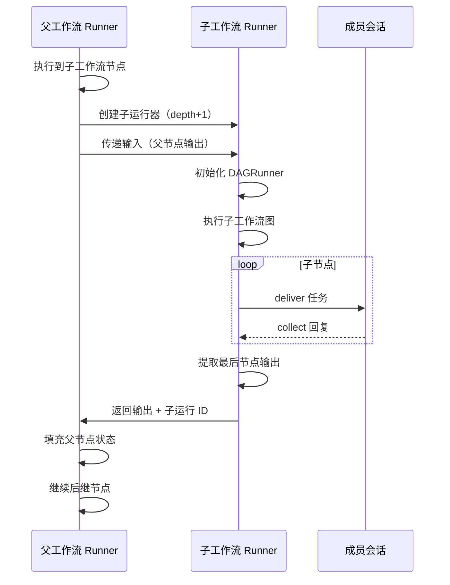

# Agent Teams 子工作流节点设计方案

- 作者：elecvoid243
- 日期：2026-09-07
- 前作：
  - [2026-09-07-agent-teams-conditional-branching-design.md](./2026-09-07-agent-teams-conditional-branching-design.md)（Phase 1）
  - [2026-09-07-agent-teams-human-input-design.md](./2026-09-07-agent-teams-human-input-design.md)（Phase 2）
  - [2026-09-07-agent-teams-loop-edges-design.md](./2026-09-07-agent-teams-loop-edges-design.md)（Phase 3）
- 状态：设计评审
- 适用基线：Agent Teams 主体功能 + Refinements + Phase 1-3 已落地

## 1. 背景与目标

Agent Teams 工作流逐渐复杂，常见两类需求：

1. **复用子流程**：多个工作流共享相同的处理逻辑（如"数据预处理"、"质量检查"、"格式转换"）
2. **模块化组织**：大型工作流分解为可折叠的逻辑单元，降低视觉复杂度

本设计引入**子工作流节点**（`subworkflow`），允许一个节点引用另一个已保存的工作流，实现真正的复用与嵌套执行。

### 1.1 核心设计决策

| 决策点 | 结论 |
|---|---|
| 实现方式 | 子工作流节点（节点类型 `subworkflow`），而非仅 UI 折叠 |
| 引用机制 | 按 `workflow_id` 引用同团队下的其他工作流 |
| 输入输出 | 隐式一进一出：`{{input}}` = 父节点输出；子工作流最后完成节点的输出 = 子工作流节点输出 |
| 递归深度 | 最多 3 层嵌套（子 → 孙 → 曾孙），防止栈溢出 |
| 状态隔离 | 子工作流运行在独立上下文中，不能访问父工作流的节点变量 |
| 失败传播 | 子工作流节点失败 → 按父工作流的 `failure_policy` 处理 |
| 导出格式 | JSON 文件（含完整图结构 + 元数据），可在 Dashboard 导入/导出 |
| 循环支持 | 子工作流内部可包含循环边；子工作流节点本身也可在循环边中 |

## 2. 数据模型

### 2.1 节点类型扩展

```typescript
// 现有节点类型
type NodeType = "member" | "human_input";

// Phase 4 扩展
type NodeType = "member" | "human_input" | "subworkflow";

interface SubworkflowNode {
  id: string;
  type: "subworkflow";
  title?: string;
  workflow_id: string;  // 引用的子工作流 ID（必填）
  
  // 输入映射（v1 隐式：{{input}} = 父节点输出）
  // v2 可扩展为显式映射：input_mapping?: {子变量名: "{{父节点.output.字段}}"}
  
  // 超时配置（可选）
  timeout?: {
    seconds: number;  // 子工作流整体超时（0=继承父 reply_timeout）
    on_timeout: "fail" | "skip";
  };
}
```

**示例**：
```json
{
  "id": "preprocess",
  "type": "subworkflow",
  "title": "数据预处理",
  "workflow_id": "wf_data_preprocessing_v2",
  "timeout": {
    "seconds": 1800,
    "on_timeout": "fail"
  }
}
```

### 2.2 工作流元数据扩展

```python
# AgentTeamWorkflow 表扩展
class AgentTeamWorkflow:
    workflow_id: str
    team_id: str
    name: str
    graph: dict  # {nodes, edges}
    layout: dict  # {node_id: {x, y}}
    created_at: str
    updated_at: str
    
    # 新增字段
    description: str = ""  # 工作流描述（导出时包含）
    tags: list[str] = []  # 标签（如 ["data", "preprocessing"]）
    is_template: bool = False  # 是否为可复用模板（Phase 5 用）
    version: str = "1.0"  # 版本号（导出时包含）
```

### 2.3 节点状态扩展

```python
node_states = {
  "preprocess": {
    "status": "done",
    "member_id": None,  # 子工作流节点无成员
    "task_rendered": None,
    "result": "预处理完成，清理了 150 条异常数据",  # 子工作流最后节点的输出
    "structured_output": {  # 子工作流最后节点的结构化输出
      "cleaned_count": 150,
      "output_path": "/data/cleaned.csv"
    },
    "error": None,
    "started_at": 1234567890.0,
    "finished_at": 1234567920.0,
    
    # 新增：子工作流执行信息
    "subworkflow_run_id": "sub_run_abc123",  # 子运行 ID（用于审计/调试）
    "subworkflow_status": "completed",  # 子工作流的最终状态
  }
}
```

### 2.4 子运行表（新增）

```python
class AgentTeamSubRun(TimestampMixin, SQLModel, table=True):
    """子工作流运行记录（嵌套运行的审计表）。"""
    
    __tablename__ = "agent_team_subruns"
    
    id: int | None = Field(default=None, primary_key=True, sa_column_kwargs={"autoincrement": True})
    sub_run_id: str = Field(max_length=32, nullable=False, unique=True)
    parent_run_id: str = Field(max_length=32, nullable=False, index=True)  # 父运行 ID
    parent_node_id: str = Field(max_length=32, nullable=False)  # 父节点 ID
    workflow_id: str = Field(max_length=32, nullable=False)  # 子工作流 ID
    depth: int = Field(nullable=False, default=1)  # 嵌套深度（1=直接子，2=孙，3=曾孙）
    
    input: str = Field(sa_type=Text, nullable=False, default="")  # 传入子工作流的输入
    status: str = Field(max_length=16, nullable=False, default="running")
    result_summary: str = Field(sa_type=Text, nullable=False, default="")
    
    # 子工作流的完整状态快照（简化版，不含转录）
    graph_snapshot: dict = Field(default_factory=dict, sa_type=JSON)
    node_states: dict = Field(default_factory=dict, sa_type=JSON)
```

**说明**：
- 父运行与子运行通过 `parent_run_id` 关联
- 用于审计、调试、历史回放
- 不存储转录（`agent_team_run_messages` 表只存顶层运行）

## 3. 执行语义

### 3.1 输入传递（隐式一进）

```
父节点 A 完成 → structured_output = {x: 1, y: 2}
  ↓
子工作流节点 B（引用 workflow_X）启动
  ↓
workflow_X 内部的 {{input}} = {x: 1, y: 2}（父节点 A 的输出）
  ↓
workflow_X 的入口节点任务模板可访问：
  - {{input.x}} → 1
  - {{input.y}} → 2
```

**打包传递**：
如果需要传递多个前驱节点的输出，父工作流需要一个"聚合节点"：
```json
{
  "id": "merge",
  "type": "member",
  "member_id": "aggregator",
  "task": "合并前驱结果并输出 JSON：\n节点 A：{{nodeA.output}}\n节点 B：{{nodeB.output}}\n\n请以 JSON 格式输出：{a_result: ..., b_result: ...}"
}
```

### 3.2 输出提取（隐式一出）

```
workflow_X 执行完成
  ↓
找出最后完成的 done 节点（可能多个并行结束，取 finished_at 最晚的）
  ↓
该节点的 structured_output = 子工作流节点 B 的 structured_output
  ↓
父工作流后继节点可访问 {{B.output.*}}
```

**边界情况**：
- 子工作流全部节点 `skipped` → 子工作流节点输出 `null`
- 子工作流失败 → 子工作流节点 `failed`，不产生输出

### 3.3 递归执行引擎

```python
class SubworkflowRunner:
    """子工作流递归执行器。"""
    
    def __init__(
        self,
        team,
        workflow,
        input_data,
        ports,
        parent_run_id: str,
        parent_node_id: str,
        depth: int
    ):
        self.team = team
        self.workflow = workflow
        self.input_data = input_data
        self.ports = ports
        self.parent_run_id = parent_run_id
        self.parent_node_id = parent_node_id
        self.depth = depth
        
        # 检查递归深度
        if depth > 3:
            raise SubworkflowError("Max nesting depth (3) exceeded")
        
        # 创建子运行记录
        self.sub_run_id = f"sub_{uuid.uuid4().hex[:12]}"
        self._create_subrun_record()
        
        # 初始化 DAGRunner（复用现有引擎）
        self.runner = DAGRunner(
            team=team,
            workflow=workflow,
            input_text=json.dumps(input_data) if isinstance(input_data, dict) else str(input_data),
            ports=ports
        )
    
    async def run(self) -> dict:
        """执行子工作流并返回输出。"""
        await self.runner.run()
        
        # 提取输出
        output = self._extract_output()
        
        # 持久化子运行
        await self._persist_subrun(output)
        
        return {
            "status": self.runner.status,
            "output": output,
            "sub_run_id": self.sub_run_id
        }
    
    def _extract_output(self) -> dict | None:
        """从子工作流提取输出（最后完成节点的输出）。"""
        done_nodes = [
            (nid, state)
            for nid, state in self.runner.node_states.items()
            if state["status"] == "done"
        ]
        
        if not done_nodes:
            return None  # 全部 skipped/failed
        
        # 按 finished_at 排序，取最晚的
        last_node_id, last_state = max(
            done_nodes,
            key=lambda x: x[1].get("finished_at", 0)
        )
        
        return last_state.get("structured_output")
```

### 3.4 嵌套调用栈

```
顶层运行 (run_123, depth=0)
  ├─ 节点 A (member)
  ├─ 节点 B (subworkflow → workflow_X)
  │   └─ 子运行 (sub_abc, depth=1, parent_run=run_123, parent_node=B)
  │       ├─ 节点 X1 (member)
  │       ├─ 节点 X2 (subworkflow → workflow_Y)
  │       │   └─ 子运行 (sub_def, depth=2, parent_run=sub_abc, parent_node=X2)
  │       │       ├─ 节点 Y1 (member)
  │       │       └─ 节点 Y2 (member)
  │       └─ 节点 X3 (member)
  └─ 节点 C (member)
```

**深度限制**：最多 3 层（depth 1/2/3），第 4 层抛异常。

## 4. 后端实现

### 4.1 DAGRunner 扩展

```python
async def _execute_node(self, node_id: str, state: dict) -> None:
    """执行节点（Phase 4 扩展）。"""
    node = self._find_node(node_id)
    node_type = node.get("type", "member")
    
    if node_type == "subworkflow":
        await self._execute_subworkflow_node(node_id, state, node)
    elif node_type == "human_input":
        await self._execute_human_input_node(node_id, state, node)
    else:  # member
        await self._execute_member_node(node_id, state, node)

async def _execute_subworkflow_node(self, node_id: str, state: dict, node: dict) -> None:
    """执行子工作流节点（Phase 4 新增）。"""
    workflow_id = node.get("workflow_id")
    if not workflow_id:
        state["status"] = "failed"
        state["error"] = "Subworkflow node missing workflow_id"
        await self._persist_run()
        return
    
    # 1. 加载子工作流
    try:
        sub_workflow = await self._load_workflow(workflow_id)
    except WorkflowNotFoundError:
        state["status"] = "failed"
        state["error"] = f"Workflow {workflow_id} not found"
        await self._persist_run()
        return
    
    # 2. 准备输入（从前驱节点提取输出）
    input_data = self._prepare_subworkflow_input(node_id)
    
    # 3. 创建子运行器
    depth = getattr(self, "depth", 0) + 1
    sub_runner = SubworkflowRunner(
        team=self.team,
        workflow=sub_workflow,
        input_data=input_data,
        ports=self.ports,  # 共享 ports（成员会话共用）
        parent_run_id=self.run_id,
        parent_node_id=node_id,
        depth=depth
    )
    
    # 4. 执行子工作流
    state["status"] = "running"
    state["started_at"] = time.time()
    await self._persist_run()
    self._emit("node_status", {"node_id": node_id, "status": "running"})
    
    try:
        timeout_seconds = node.get("timeout", {}).get("seconds", 0) or self.config.get("reply_timeout", 600)
        result = await asyncio.wait_for(
            sub_runner.run(),
            timeout=timeout_seconds * 10  # 子工作流超时 = 节点数 × reply_timeout（估算）
        )
        
        # 5. 提取输出
        if result["status"] == "completed":
            state["status"] = "done"
            state["result"] = json.dumps(result["output"], ensure_ascii=False) if result["output"] else ""
            state["structured_output"] = result["output"]
        elif result["status"] == "stopped":
            state["status"] = "failed"
            state["error"] = "Subworkflow was stopped"
        else:
            state["status"] = "failed"
            state["error"] = f"Subworkflow failed: {result.get('error', 'unknown')}"
        
        state["subworkflow_run_id"] = result["sub_run_id"]
        state["subworkflow_status"] = result["status"]
    
    except asyncio.TimeoutError:
        state["status"] = "failed"
        state["error"] = "Subworkflow execution timeout"
        # TODO: 取消子运行
    
    except Exception as e:
        state["status"] = "failed"
        state["error"] = f"Subworkflow execution error: {e}"
    
    state["finished_at"] = time.time()
    await self._persist_run()
    self._emit("node_status", {
        "node_id": node_id,
        "status": state["status"],
        "structured_output": state.get("structured_output"),
        "error": state.get("error")
    })

def _prepare_subworkflow_input(self, node_id: str) -> dict | str:
    """准备子工作流输入（从前驱节点提取输出）。"""
    predecessors = [e["from"] for e in self.graph["edges"] if e["to"] == node_id]
    
    if not predecessors:
        return self.input_text  # 入口子工作流节点，使用顶层输入
    
    # 取第一个完成的前驱节点的输出
    for pred_id in predecessors:
        pred_state = self.node_states[pred_id]
        if pred_state["status"] == "done" and pred_state.get("structured_output"):
            return pred_state["structured_output"]
    
    # 无结构化输出，回退到文本
    for pred_id in predecessors:
        pred_state = self.node_states[pred_id]
        if pred_state["status"] == "done":
            return pred_state.get("result", "")
    
    return ""
```

### 4.2 工作流校验

```python
def validate_workflow_with_subworkflows(
    nodes: list[dict],
    edges: list[dict],
    team_id: str,
    db
) -> list[dict]:
    """校验包含子工作流的工作流（Phase 4）。"""
    errors = []
    
    # 现有校验（DAG、循环边、Human Input 等）
    # ...
    
    # 新增：子工作流节点校验
    for i, node in enumerate(nodes):
        if node.get("type") != "subworkflow":
            continue
        
        # 1. 必须有 workflow_id
        workflow_id = node.get("workflow_id")
        if not workflow_id:
            errors.append({
                "path": f"nodes[{i}].workflow_id",
                "code": "REQUIRED",
                "message": "Subworkflow node must have workflow_id"
            })
            continue
        
        # 2. 引用的工作流必须存在且属于同团队
        try:
            sub_workflow = db.query(AgentTeamWorkflow).filter(
                AgentTeamWorkflow.workflow_id == workflow_id,
                AgentTeamWorkflow.team_id == team_id
            ).first()
            
            if not sub_workflow:
                errors.append({
                    "path": f"nodes[{i}].workflow_id",
                    "code": "NOT_FOUND",
                    "message": f"Workflow {workflow_id} not found in this team"
                })
                continue
            
            # 3. 检测循环引用（A 引用 B，B 引用 A）
            if _has_circular_reference(workflow_id, nodes, db, visited=set()):
                errors.append({
                    "path": f"nodes[{i}].workflow_id",
                    "code": "CIRCULAR_REFERENCE",
                    "message": f"Circular subworkflow reference detected"
                })
        
        except Exception as e:
            errors.append({
                "path": f"nodes[{i}].workflow_id",
                "code": "VALIDATION_ERROR",
                "message": str(e)
            })
    
    return errors

def _has_circular_reference(
    workflow_id: str,
    parent_nodes: list[dict],
    db,
    visited: set[str]
) -> bool:
    """递归检测循环引用。"""
    if workflow_id in visited:
        return True  # 循环
    
    visited.add(workflow_id)
    
    # 加载子工作流
    sub_workflow = db.query(AgentTeamWorkflow).filter(
        AgentTeamWorkflow.workflow_id == workflow_id
    ).first()
    
    if not sub_workflow:
        return False
    
    # 检查子工作流的所有子工作流节点
    sub_nodes = sub_workflow.graph.get("nodes", [])
    for node in sub_nodes:
        if node.get("type") == "subworkflow":
            if _has_circular_reference(node["workflow_id"], sub_nodes, db, visited.copy()):
                return True
    
    return False
```

## 5. 导出 / 导入功能

### 5.1 导出格式

```json
{
  "format": "astrbot-agent-teams-workflow",
  "version": "1.0",
  "exported_at": "2026-09-07T22:00:00+08:00",
  "exported_by": "astrbot",
  
  "workflow": {
    "name": "数据预处理",
    "description": "清洗原始数据，移除异常值，标准化格式",
    "version": "1.0",
    "tags": ["data", "preprocessing"],
    
    "graph": {
      "nodes": [
        {
          "id": "validate",
          "type": "member",
          "member_id": "validator",
          "title": "数据校验",
          "task": "校验数据完整性"
        },
        {
          "id": "clean",
          "type": "member",
          "member_id": "cleaner",
          "task": "清理异常数据"
        }
      ],
      "edges": [
        {"from": "validate", "to": "clean"}
      ]
    },
    
    "layout": {
      "validate": {"x": 100, "y": 100},
      "clean": {"x": 300, "y": 100}
    },
    
    "member_requirements": [
      {
        "member_id": "validator",
        "name": "数据校验器",
        "suggested_persona": "data-validator",
        "note": "建议使用具有数据分析能力的模型"
      },
      {
        "member_id": "cleaner",
        "name": "数据清洗器",
        "suggested_persona": "data-cleaner"
      }
    ]
  }
}
```

**关键字段**：
- `member_requirements`：记录成员需求（导入时需映射到目标团队的成员）
- `suggested_persona`：建议的人格（导入时可选择替换）

### 5.2 导出 API

```
GET /api/v1/agent_teams/workflows/{workflow_id}/export
```

**响应**：
- Content-Type: `application/json`
- Content-Disposition: `attachment; filename="workflow-{name}-{timestamp}.json"`

### 5.3 导入 API

```
POST /api/v1/agent_teams/{team_id}/workflows/import
Content-Type: multipart/form-data
```

**请求体**：
- `file`: JSON 文件
- `member_mapping`: JSON 字符串，映射成员 ID
  ```json
  {
    "validator": "m1",  // 源 member_id → 目标团队的 member_id
    "cleaner": "m2"
  }
  ```

**处理逻辑**：
1. 解析 JSON，校验格式版本
2. 校验 `member_mapping` 完整性（所有 `member_requirements` 都有映射）
3. 替换节点中的 `member_id`
4. 生成新的 `workflow_id` 和 `node_id`（避免冲突）
5. 保存到目标团队
6. 返回新 `workflow_id`

**响应**：
```json
{
  "status": "ok",
  "data": {
    "workflow_id": "wf_new_123",
    "name": "数据预处理",
    "unmapped_members": []  // 未映射的成员（警告）
  }
}
```

## 6. 前端实现

### 6.1 编辑器 - 子工作流节点

#### 左侧面板

```vue
<div class="special-nodes-section">
  <h3>特殊节点</h3>
  
  <div class="special-node-card" draggable @dragstart="onDragSpecialNode('human_input')">
    <v-icon>mdi-account-question</v-icon>
    人工输入
  </div>
  
  <!-- 新增 -->
  <div class="special-node-card" draggable @dragstart="onDragSpecialNode('subworkflow')">
    <v-icon>mdi-file-tree-outline</v-icon>
    子工作流
  </div>
</div>
```

#### 节点属性面板

```vue
<div v-if="selectedNode?.type === 'subworkflow'" class="node-inspector-subworkflow">
  <h3>子工作流节点</h3>
  
  <v-text-field v-model="selectedNode.title" label="节点标题" />
  
  <v-select
    v-model="selectedNode.workflow_id"
    :items="availableWorkflows"
    item-title="name"
    item-value="workflow_id"
    label="引用工作流 *"
    :error-messages="workflowIdError"
    required
  >
    <template #prepend-inner>
      <v-icon>mdi-file-tree</v-icon>
    </template>
    <template #item="{ props, item }">
      <v-list-item v-bind="props">
        <v-list-item-subtitle>
          {{ item.raw.description || '无描述' }}
        </v-list-item-subtitle>
        <template #append>
          <v-chip v-for="tag in item.raw.tags" :key="tag" size="x-small">
            {{ tag }}
          </v-chip>
        </template>
      </v-list-item>
    </template>
  </v-select>
  
  <v-alert v-if="selectedWorkflowPreview" type="info" density="compact">
    <strong>工作流预览：</strong><br>
    节点数：{{ selectedWorkflowPreview.nodeCount }}<br>
    成员需求：{{ selectedWorkflowPreview.memberCount }} 个
  </v-alert>
  
  <!-- 超时配置 -->
  <v-expansion-panels class="mt-4">
    <v-expansion-panel>
      <v-expansion-panel-title>超时设置（可选）</v-expansion-panel-title>
      <v-expansion-panel-text>
        <v-text-field
          v-model.number="selectedNode.timeout.seconds"
          label="超时秒数（0=自动计算）"
          type="number"
          min="0"
        />
        <v-select
          v-model="selectedNode.timeout.on_timeout"
          :items="[{value: 'fail', title: '失败'}, {value: 'skip', title: '跳过'}]"
          label="超时行为"
        />
      </v-expansion-panel-text>
    </v-expansion-panel>
  </v-expansion-panels>
  
  <!-- 循环引用检测 -->
  <v-alert v-if="circularReferenceDetected" type="error" density="compact" class="mt-2">
    <v-icon>mdi-alert-circle</v-icon>
    检测到循环引用！此工作流引用了包含当前工作流的子工作流。
  </v-alert>
</div>
```

### 6.2 编辑器 - 导出/导入

#### 工具栏按钮

```vue
<template>
  <div class="editor-toolbar">
    <!-- 现有按钮 -->
    
    <v-menu>
      <template #activator="{ props }">
        <v-btn variant="text" v-bind="props">
          <v-icon>mdi-dots-vertical</v-icon>
        </v-btn>
      </template>
      <v-list>
        <v-list-item @click="onExportWorkflow">
          <template #prepend>
            <v-icon>mdi-download</v-icon>
          </template>
          <v-list-item-title>导出工作流</v-list-item-title>
        </v-list-item>
        <v-list-item @click="showImportDialog = true">
          <template #prepend>
            <v-icon>mdi-upload</v-icon>
          </template>
          <v-list-item-title>导入工作流</v-list-item-title>
        </v-list-item>
      </v-list>
    </v-menu>
  </div>
</template>

<script setup lang="ts">
async function onExportWorkflow() {
  if (!selectedWorkflowId.value) {
    error('请先选择要导出的工作流');
    return;
  }
  
  try {
    const response = await agentTeamsApi.exportWorkflow(selectedWorkflowId.value);
    
    // 触发下载
    const blob = new Blob([JSON.stringify(response.data, null, 2)], {
      type: 'application/json'
    });
    const url = URL.createObjectURL(blob);
    const a = document.createElement('a');
    a.href = url;
    a.download = `workflow-${response.data.workflow.name}-${Date.now()}.json`;
    a.click();
    URL.revokeObjectURL(url);
    
    success('工作流已导出');
  } catch (err) {
    error('导出失败：' + extractApiError(err).message);
  }
}
</script>
```

#### 导入对话框

```vue
<v-dialog v-model="showImportDialog" max-width="600px">
  <v-card>
    <v-card-title class="text-h3 pa-4 pb-0 pl-6">导入工作流</v-card-title>
    
    <v-card-text class="pa-6">
      <v-file-input
        v-model="importFile"
        label="选择工作流文件"
        accept=".json"
        prepend-icon="mdi-file-upload"
        @change="onFileSelected"
      />
      
      <!-- 文件解析预览 -->
      <div v-if="importPreview" class="import-preview mt-4">
        <v-alert type="info" density="compact">
          <strong>{{ importPreview.name }}</strong><br>
          {{ importPreview.description }}<br>
          节点数：{{ importPreview.nodeCount }}
        </v-alert>
        
        <!-- 成员映射 -->
        <h4 class="mt-4 mb-2">成员映射</h4>
        <v-alert v-if="!importPreview.memberRequirements.length" type="success" density="compact">
          此工作流不包含成员节点，无需映射
        </v-alert>
        <div v-else class="member-mapping">
          <div
            v-for="req in importPreview.memberRequirements"
            :key="req.member_id"
            class="mapping-row"
          >
            <v-text-field
              :value="req.name"
              label="源成员"
              readonly
              density="compact"
            />
            <v-icon>mdi-arrow-right</v-icon>
            <v-select
              v-model="memberMapping[req.member_id]"
              :items="availableMembers"
              item-title="name"
              item-value="member_id"
              label="映射到团队成员"
              density="compact"
              :hint="req.note"
              persistent-hint
            />
          </div>
        </div>
      </div>
    </v-card-text>
    
    <v-card-actions class="pa-4">
      <v-spacer />
      <v-btn variant="text" @click="showImportDialog = false">取消</v-btn>
      <v-btn
        variant="tonal"
        color="primary"
        :loading="importing"
        :disabled="!canImport"
        @click="onImportConfirm"
      >
        导入
      </v-btn>
    </v-card-actions>
  </v-card>
</v-dialog>

<script setup lang="ts">
const importFile = ref<File[]>([]);
const importPreview = ref<any>(null);
const memberMapping = ref<Record<string, string>>({});
const importing = ref(false);

async function onFileSelected() {
  if (!importFile.value.length) return;
  
  try {
    const text = await importFile.value[0].text();
    const data = JSON.parse(text);
    
    // 校验格式
    if (data.format !== 'astrbot-agent-teams-workflow') {
      error('不支持的文件格式');
      return;
    }
    
    // 提取预览信息
    importPreview.value = {
      name: data.workflow.name,
      description: data.workflow.description,
      nodeCount: data.workflow.graph.nodes.length,
      memberRequirements: data.workflow.member_requirements || []
    };
    
    // 初始化映射（空）
    memberMapping.value = {};
    
  } catch (err) {
    error('文件解析失败：' + err.message);
  }
}

const canImport = computed(() => {
  if (!importPreview.value) return false;
  
  // 检查所有必需成员是否已映射
  const reqs = importPreview.value.memberRequirements;
  if (reqs.length === 0) return true;
  
  return reqs.every(req => memberMapping.value[req.member_id]);
});

async function onImportConfirm() {
  importing.value = true;
  
  try {
    const formData = new FormData();
    formData.append('file', importFile.value[0]);
    formData.append('member_mapping', JSON.stringify(memberMapping.value));
    
    const result = await agentTeamsApi.importWorkflow(selectedTeam.value.team_id, formData);
    
    success(`工作流"${result.data.name}"已导入`);
    showImportDialog.value = false;
    
    // 刷新工作流列表
    await loadWorkflows(selectedTeam.value.team_id);
    
  } catch (err) {
    error('导入失败：' + extractApiError(err).message);
  } finally {
    importing.value = false;
  }
}
</script>
```

### 6.3 监控视图 - 子工作流展开

```vue
<div class="subworkflow-node-card">
  <div class="node-header">
    <v-icon>mdi-file-tree-outline</v-icon>
    <span>{{ node.title }}</span>
    <v-chip size="x-small">子工作流</v-chip>
    
    <!-- 展开按钮 -->
    <v-btn
      v-if="nodeState.subworkflow_run_id"
      icon="mdi-arrow-expand"
      size="x-small"
      variant="text"
      @click="onExpandSubworkflow(nodeState.subworkflow_run_id)"
    />
  </div>
  
  <div class="node-body">
    <div v-if="nodeState.status === 'running'">
      执行中...
    </div>
    <div v-else-if="nodeState.status === 'done'">
      <div class="subworkflow-summary">
        {{ nodeState.result || '完成' }}
      </div>
      <!-- 输出预览 -->
      <div v-if="nodeState.structured_output" class="output-preview">
        <v-expansion-panels density="compact">
          <v-expansion-panel>
            <v-expansion-panel-title>输出</v-expansion-panel-title>
            <v-expansion-panel-text>
              <pre>{{ JSON.stringify(nodeState.structured_output, null, 2) }}</pre>
            </v-expansion-panel-text>
          </v-expansion-panel>
        </v-expansion-panels>
      </div>
    </div>
  </div>
</div>

<!-- 子工作流详情对话框 -->
<v-dialog v-model="showSubworkflowDetail" max-width="1200px" scrollable>
  <v-card>
    <v-card-title class="text-h3 pa-4 pb-0 pl-6">
      子工作流执行详情
      <v-chip size="small" class="ml-2">深度 {{ subworkflowDetail?.depth }}</v-chip>
    </v-card-title>
    
    <v-card-text class="pa-6">
      <!-- 渲染子工作流的 DAG 视图（只读） -->
      <TeamsFlowCanvas
        :nodes="subworkflowDetail?.graph.nodes"
        :edges="subworkflowDetail?.graph.edges"
        :node-states="subworkflowDetail?.node_states"
        :readonly="true"
      />
    </v-card-text>
    
    <v-card-actions>
      <v-spacer />
      <v-btn variant="text" @click="showSubworkflowDetail = false">关闭</v-btn>
    </v-card-actions>
  </v-card>
</v-dialog>

<script setup lang="ts">
async function onExpandSubworkflow(subRunId: string) {
  try {
    const detail = await agentTeamsApi.getSubrunDetail(subRunId);
    subworkflowDetail.value = detail.data;
    showSubworkflowDetail.value = true;
  } catch (err) {
    error('加载子工作流详情失败');
  }
}
</script>
```

## 7. 典型场景

### 7.1 数据处理管道

```
主工作流：ETL 流程
  ├─ 节点 A：提取数据
  ├─ 节点 B（子工作流）：数据预处理
  │   └─ 子工作流：preprocessing_v2
  │       ├─ 校验数据完整性
  │       ├─ 清理异常值
  │       └─ 标准化格式
  ├─ 节点 C（子工作流）：特征工程
  │   └─ 子工作流：feature_engineering
  │       ├─ 归一化
  │       ├─ PCA 降维
  │       └─ 特征选择
  └─ 节点 D：训练模型
```

### 7.2 文档生成流水线

```
主工作流：生成技术文档
  ├─ 需求分析
  ├─ 子工作流：代码分析
  │   ├─ 解析代码结构
  │   ├─ 提取 API 签名
  │   └─ 生成调用示例
  ├─ 子工作流：文档撰写
  │   ├─ 生成概述
  │   ├─ 编写 API 说明
  │   └─ 添加使用示例
  ├─ 人工审校
  └─ 发布
```

### 7.3 复用子工作流

```
预处理工作流（可复用）
  ├─ 校验
  ├─ 清洗
  └─ 标准化

项目 A：销售数据分析
  ├─ 节点 1（子工作流：预处理）
  ├─ 节点 2：销售趋势分析
  └─ 节点 3：生成报告

项目 B：用户行为分析
  ├─ 节点 1（子工作流：预处理）  ← 复用
  ├─ 节点 2：行为聚类
  └─ 节点 3：推荐策略
```

## 8. 测试策略

### 8.1 后端 pytest

```python
@pytest.mark.asyncio
async def test_simple_subworkflow():
    """测试简单子工作流执行。"""
    # 创建子工作流
    sub_workflow = {
        "nodes": [
            {"id": "sub1", "member_id": "m1", "task": "子任务 1"},
            {"id": "sub2", "member_id": "m2", "task": "子任务 2：{{input}}"}
        ],
        "edges": [{"from": "sub1", "to": "sub2"}]
    }
    
    # 主工作流
    main_workflow = {
        "nodes": [
            {"id": "main1", "member_id": "m1", "task": "主任务"},
            {"id": "sub_node", "type": "subworkflow", "workflow_id": "sub_wf_1"}
        ],
        "edges": [{"from": "main1", "to": "sub_node"}]
    }
    
    # 脚本化回复
    ports.script_collect("m1", '{"data": "hello"}')  # main1 输出
    ports.script_collect("m1", "sub1 完成")
    ports.script_collect("m2", '{"result": "processed"}')  # sub2 输出
    
    runner = DAGRunner(team, main_workflow, "test", ports)
    await runner.run()
    
    # 断言
    assert runner.node_states["sub_node"]["status"] == "done"
    assert runner.node_states["sub_node"]["structured_output"] == {"result": "processed"}

@pytest.mark.asyncio
async def test_nested_subworkflows():
    """测试嵌套子工作流（3 层）。"""
    # 层 3（曾孙）
    level3_wf = {
        "nodes": [{"id": "l3", "member_id": "m1", "task": "level 3"}],
        "edges": []
    }
    
    # 层 2（孙）
    level2_wf = {
        "nodes": [
            {"id": "l2", "member_id": "m1", "task": "level 2"},
            {"id": "l2_sub", "type": "subworkflow", "workflow_id": "wf_level3"}
        ],
        "edges": [{"from": "l2", "to": "l2_sub"}]
    }
    
    # 层 1（子）
    level1_wf = {
        "nodes": [
            {"id": "l1", "member_id": "m1", "task": "level 1"},
            {"id": "l1_sub", "type": "subworkflow", "workflow_id": "wf_level2"}
        ],
        "edges": [{"from": "l1", "to": "l1_sub"}]
    }
    
    # 主工作流
    main_wf = {
        "nodes": [
            {"id": "main", "member_id": "m1", "task": "main"},
            {"id": "main_sub", "type": "subworkflow", "workflow_id": "wf_level1"}
        ],
        "edges": [{"from": "main", "to": "main_sub"}]
    }
    
    # ... 执行并断言深度 = 3 ...

@pytest.mark.asyncio
async def test_max_depth_exceeded():
    """测试超过最大嵌套深度（4 层）应失败。"""
    # 构造 4 层嵌套
    # ...
    
    runner = DAGRunner(team, main_wf, "test", ports)
    await runner.run()
    
    assert runner.status == "failed"
    assert "Max nesting depth" in runner.node_states["sub_node"]["error"]

def test_circular_reference_detection():
    """测试循环引用检测。"""
    # 工作流 A 引用 B，B 引用 A
    errors = validate_workflow_with_subworkflows(
        nodes_a,
        edges_a,
        team_id,
        db
    )
    
    assert any(e["code"] == "CIRCULAR_REFERENCE" for e in errors)

def test_export_import_roundtrip():
    """测试导出-导入往返。"""
    # 导出
    exported = export_workflow(workflow_id)
    
    # 修改 member_mapping
    member_mapping = {"m1": "m2"}
    
    # 导入
    imported_id = import_workflow(team_id, exported, member_mapping)
    
    # 断言
    imported_wf = db.query(AgentTeamWorkflow).filter(
        AgentTeamWorkflow.workflow_id == imported_id
    ).first()
    
    assert imported_wf.name == exported["workflow"]["name"]
    assert imported_wf.graph["nodes"][0]["member_id"] == "m2"  # 映射生效
```

### 8.2 前端 vitest

```typescript
it('validates circular reference', () => {
  const nodes = [
    {id: 'a', type: 'subworkflow', workflow_id: 'wf_b'}
  ];
  
  // Mock: wf_b 引用 wf_a（当前工作流）
  const error = detectCircularReference(nodes, 'wf_a', mockWorkflows);
  expect(error).toBeTruthy();
});

it('parses import file and extracts member requirements', async () => {
  const file = new File([JSON.stringify(mockExportedWorkflow)], 'test.json');
  const preview = await parseImportFile(file);
  
  expect(preview.memberRequirements).toHaveLength(2);
  expect(preview.memberRequirements[0].member_id).toBe('validator');
});

it('disables import button until all members mapped', () => {
  const wrapper = mount(ImportDialog, {
    props: {
      importPreview: {memberRequirements: [{member_id: 'm1'}]},
      memberMapping: {}
    }
  });
  
  expect(wrapper.find('[data-test="import-btn"]').attributes('disabled')).toBeDefined();
});
```

### 8.3 手工验收

1. **创建子工作流**：保存"数据预处理"工作流（2 个节点）
2. **引用子工作流**：主工作流拖入子工作流节点，选择"数据预处理"
3. **执行嵌套流**：运行主工作流，观察子工作流节点展开为多个成员执行
4. **输出传递**：主节点输出 `{x: 1}` → 子工作流 `{{input.x}}` 可访问
5. **导出工作流**：点击导出，下载 JSON 文件
6. **导入工作流**：新建团队，导入文件，映射成员，成功创建
7. **循环引用警告**：A 引用 B，B 引用 A → 保存时报错
8. **深度限制**：创建 4 层嵌套 → 执行失败并提示超过深度限制

## 9. 已否决的备选方案

| 备选 | 否决理由 |
|---|---|
| 仅 UI 折叠（不真实执行） | 无法实现真正复用；只是视觉组织 |
| 显式输入输出映射（v1） | 增加配置复杂度；隐式一进一出已满足绝大多数场景（v2 可扩展） |
| 子工作流访问父变量 | 破坏封装；子工作流应独立可测试 |
| 无限嵌套深度 | 栈溢出风险；3 层已足够（实践中 2 层即可） |
| 子工作流与父工作流共享转录表 | 混淆不同层级的消息；独立子运行表更清晰 |
| 允许跨团队引用工作流 | 权限复杂化；成员会话跨团队不可行 |

## 10. 与其他 Phase 的协同

### 10.1 与 Phase 1（条件分支）

- 子工作流节点的输出可用于条件判断
  ```json
  {"from": "preprocess", "to": "analyze", 
   "condition": "{{preprocess.output.success}} == true"}
  ```

### 10.2 与 Phase 2（Human Input）

- 子工作流内部可包含 Human Input 节点
- 父工作流在子工作流的 Human Input 等待期间也暂停

### 10.3 与 Phase 3（循环边）

- 子工作流节点可在循环边中
  ```
  测试 → [失败] → 子工作流（修复策略）→ 测试（循环）
  ```
- 子工作流内部可包含循环边（独立计数）

### 10.4 与 Phase 5（模板库）

- 导出的工作流 JSON 可直接上传到模板库
- 模板库的工作流可一键导入为子工作流

## 11. 未来扩展方向

1. **参数化子工作流**：
   - 显式输入映射：`input_mapping: {param1: "{{parent.output.x}}", param2: "fixed_value"}`
   - 多输出节点选择：`output_node_id: "specific_node"`

2. **子工作流版本管理**：
   - 引用特定版本：`workflow_id: "wf_preprocessing@v2"`
   - 版本兼容性检查

3. **子工作流库**：
   - 官方子工作流库（常用模式）
   - 社区贡献与评分

4. **性能优化**：
   - 子工作流节点并行执行（多个子工作流节点同时运行）
   - 子工作流缓存（相同输入 → 复用结果）

## 12. 迁移与兼容性

- **现有工作流零改动**：无 `subworkflow` 节点的工作流行为不变
- **新表独立**：`agent_team_subruns` 表仅记录子运行，不影响现有表结构
- **导出格式版本化**：`version` 字段标识格式，未来可平滑升级
- **前端渐进增强**：老版本编辑器遇到 `subworkflow` 节点会显示为"不支持的节点类型"（降级显示）

---

## 附录 A：子工作流执行流程图



## 附录 B：导出文件完整示例

见 §5.1。

## 附录 C：嵌套深度限制理由

| 深度 | 场景 | 示例 |
|---|---|---|
| 1 层 | 简单复用 | 主流程 → 预处理子工作流 |
| 2 层 | 模块化大型流程 | 主流程 → 数据处理（子）→ 清洗（孙） |
| 3 层 | 极端复杂场景 | 主 → ETL（子）→ 转换（孙）→ 格式化（曾孙） |
| 4 层+ | ❌ 不支持 | 可读性差、调试困难、栈溢出风险 |

实践建议：大多数场景用 1-2 层；超过 3 层应重新设计（扁平化或合并子图）。
